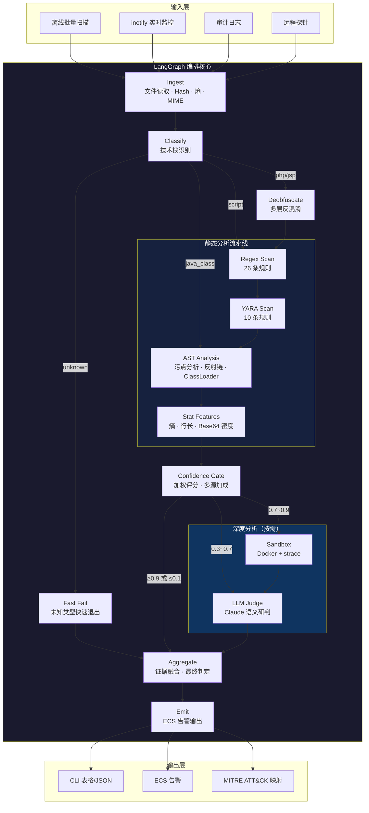
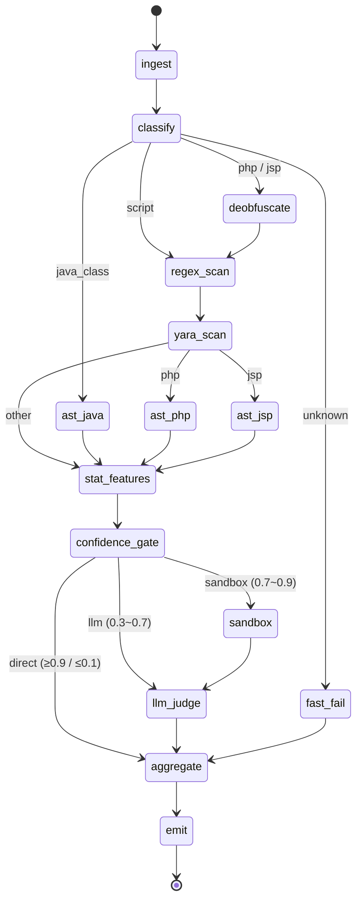
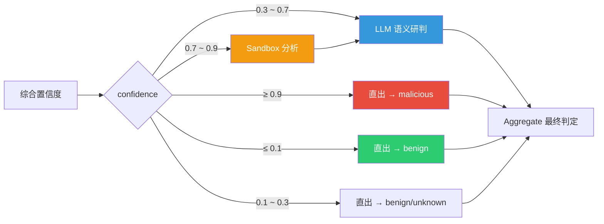
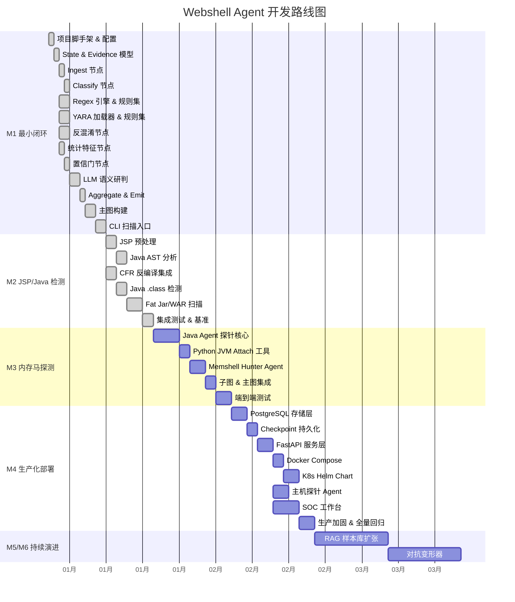
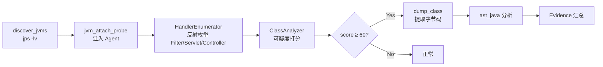
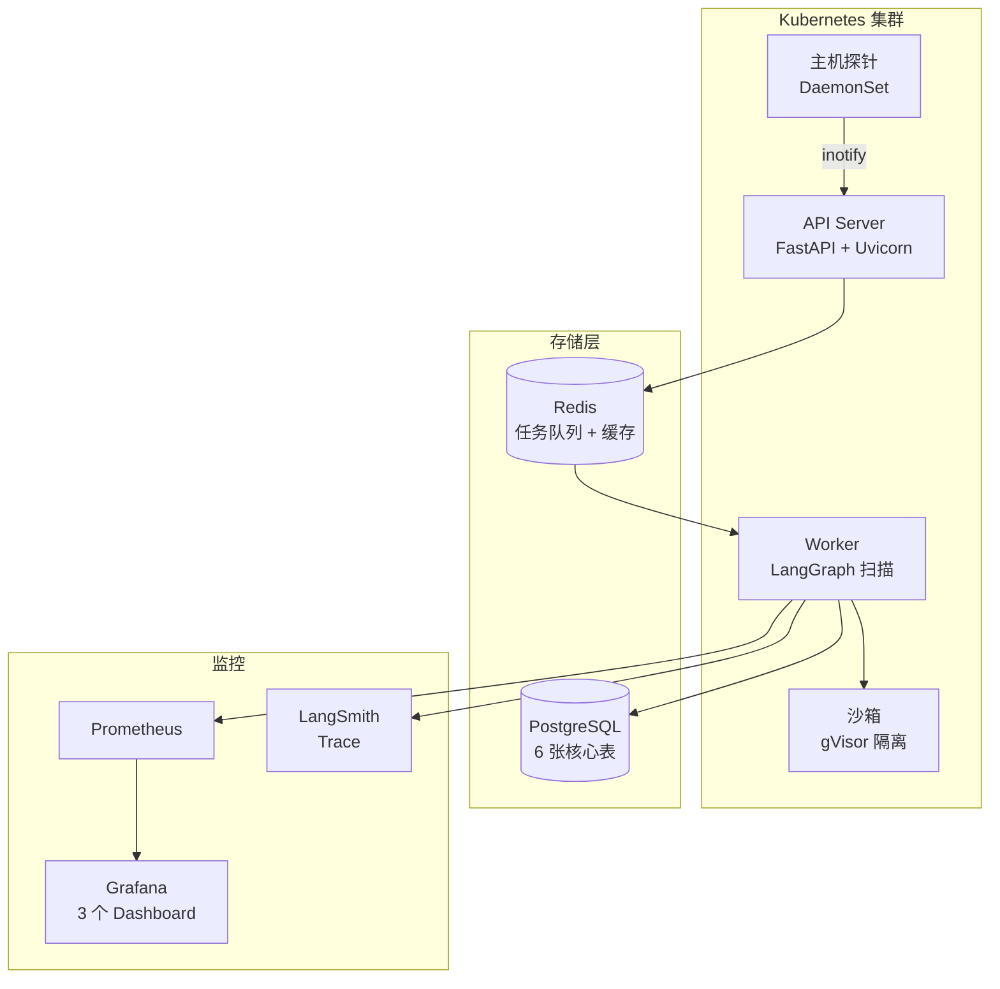

# Webshell Agent (WSA)

基于 LangGraph 的 Agent 化 Webshell 检测系统。核心思路：**规则做召回，语义做精度，沙箱做确认**。

覆盖 Nginx-PHP、Tomcat（JSP/Servlet）、Spring Boot（含内存马）三大技术栈，支持离线批量扫描和实时监测两种模式。

## 系统架构



## LangGraph 管道流程



## 置信门决策逻辑



## 快速开始

### 环境要求

- Python 3.11+（推荐 3.12）
- [uv](https://github.com/astral-sh/uv) 包管理器
- JDK 11+（可选，用于 .class 反编译）
- Anthropic API Key（可选，用于 LLM 语义研判）

### 安装

```bash
# 克隆项目
git clone <repo-url> webshell-agent
cd webshell-agent

# 创建虚拟环境并安装依赖
uv venv --python 3.12
uv pip install -e ".[dev]"

# 配置 LLM（可选）
export ANTHROPIC_API_KEY="sk-ant-..."
```

### 基本使用

```bash
# 扫描单个文件
wsa scan suspicious.jsp

# 扫描目录（递归）
wsa scan /var/www/html/ --verbose

# 扫描 JAR/WAR 包
wsa scan app.war

# 输出 JSON 格式
wsa scan target/ --format json --output results.json

# 跳过 LLM 分析（纯静态检测，更快）
wsa scan target/ --no-llm

# 并发扫描，指定线程数
wsa scan /opt/tomcat/webapps/ --workers 8

# 按扩展名过滤
wsa scan target/ --include "*.jsp"
```

### CLI 参数

| 参数 | 说明 | 默认值 |
|------|------|--------|
| `TARGET` | 扫描目标（文件/目录/ZIP） | 必填 |
| `--format, -f` | 输出格式：table / json / jsonl | table |
| `--output, -o` | 输出到文件 | stdout |
| `--workers, -w` | 并发线程数 | 4 |
| `--include` | Glob 包含模式 | 全部 |
| `--exclude` | Glob 排除模式 | 无 |
| `--no-llm` | 跳过 LLM 分析 | false |
| `--verbose, -v` | 详细输出（显示 Top Evidence） | false |

### 退出码

| 退出码 | 含义 |
|--------|------|
| 0 | 全部 benign |
| 1 | 发现 malicious |
| 2 | 发现 suspicious |
| 3 | 扫描出错 |

### 输出示例

```
                              Scan Results
┌──────────────────┬───────┬────────────┬────────────┬──────────┐
│ File             │ Stack │  Verdict   │ Confidence │ Evidence │
├──────────────────┼───────┼────────────┼────────────┼──────────┤
│ behinder_v3.jsp  │ jsp   │ MALICIOUS  │     100.0% │        5 │
│ cmd_exec.jsp     │ jsp   │ MALICIOUS  │     100.0% │        3 │
│ godzilla.jsp     │ jsp   │ MALICIOUS  │     100.0% │        3 │
│ script_engine.j… │ jsp   │ MALICIOUS  │      90.0% │        3 │
│ file_upload.jsp  │ jsp   │ SUSPICIOUS │      68.0% │        2 │
│ hello.jsp        │ jsp   │   BENIGN   │       5.0% │        0 │
│ dashboard.jsp    │ jsp   │   BENIGN   │       5.0% │        0 │
└──────────────────┴───────┴────────────┴────────────┴──────────┘
┌─────────────────────── Summary ───────────────────────┐
│ Total: 7 │ 4 malicious │ 1 suspicious │ 2 benign     │
└──────────────────────────────────────────────────────-┘
```

## 配置

所有配置通过环境变量设置，前缀 `WSA_`：

```bash
# LLM 配置
export WSA_LLM_PROVIDER=anthropic          # anthropic / openai / local
export WSA_LLM_MODEL=claude-sonnet-4-20250514
export WSA_LLM_TEMPERATURE=0.0

# 置信门阈值
export WSA_GATE_HIGH=0.9                   # ≥ 此值直出 malicious
export WSA_GATE_LOW=0.1                    # ≤ 此值直出 benign

# 扫描参数
export WSA_MAX_FILE_SIZE_MB=50
export WSA_SCAN_TIMEOUT_SEC=30
export WSA_SCAN_WORKERS=4

# 规则目录
export WSA_RULES_DIR=rules
export WSA_YARA_DIR=rules/yara
export WSA_REGEX_DIR=rules/regex
```

## 检测能力

### 检测引擎

| 引擎 | 方法 | 规则数 | 权重 | 用途 |
|------|------|--------|------|------|
| Regex | YAML 驱动正则匹配 | 26 条 | 0.9 | 已知特征召回 |
| YARA | 二进制/文本模式匹配 | 10 条 | 1.0 | 字节码级检测 |
| AST | javalang 污点分析 | 4 类检测 | 1.0 | Source→Sink 路径 |
| Stat | 熵/行长/Base64 密度 | 3 类异常 | 0.5 | 辅助信号 |
| LLM | Claude 语义研判 | - | 0.8 | 未知变种精度 |

### 覆盖的威胁类型

**JSP Webshell（14 条 Regex + 5 条 YARA）：**
- Runtime.exec / ProcessBuilder 命令执行
- 反射链（Class.forName → getMethod → invoke）
- BCEL ClassLoader 滥用
- 冰蝎（Behinder）v3/v4
- 哥斯拉（Godzilla）
- ScriptEngine 动态执行
- 文件写入后门
- Thread ClassLoader 操纵

**Java .class（12 条 Regex + 5 条 YARA）：**
- Runtime.exec / ProcessBuilder
- 反射链 / defineClass
- BCEL / Unsafe
- 反序列化（ObjectInputStream）
- JNDI 注入
- EL 表达式注入
- Base64 + ClassLoader 组合

**AST 分析（4 类检测）：**
- 污点分析：request.getParameter → exec/eval/FileOutputStream
- 反射链检测：Class.forName → getMethod → invoke
- ClassLoader 滥用：defineClass / loadClass
- 危险类型实例化：Runtime / ProcessBuilder / ScriptEngine

### 判定逻辑

```
最终判定 = f(静态置信度, LLM 判定, Sandbox 报告)

静态置信度 = max(各证据加权分) + 多源加成(+0.1) + 统计异常加成(+0.05)
  权重: yara=1.0, regex=0.9, ast=1.0, stat=0.5

LLM 融合:
  静态说 malicious + LLM 说 benign → 0.7×静态 + 0.3×LLM（保守）
  其他情况 → 0.6×静态 + 0.4×LLM

判定阈值:
  ≥ 0.8 → malicious
  ≥ 0.4 → suspicious
  ≤ 0.15 → benign
  其他 → unknown
```

## 项目结构

```
webshell-agent/
├── pyproject.toml                    # 项目配置 & 依赖
├── webshell_agent_design.md          # 完整设计文档
├── rules/
│   ├── regex/
│   │   ├── java_webshell.yaml        # 12 条 Java 正则规则
│   │   └── jsp_webshell.yaml         # 14 条 JSP 正则规则
│   ├── yara/
│   │   ├── java/suspicious_class.yar # 5 条 Java YARA 规则
│   │   └── jsp/webshell_generic.yar  # 5 条 JSP YARA 规则
│   └── java_lib_whitelist.yaml       # JAR 白名单（Spring, Tomcat 等）
├── src/wsa/
│   ├── config.py                     # pydantic-settings 配置
│   ├── state.py                      # ScanState / Evidence / FileMeta
│   ├── graph.py                      # LangGraph 主图（15 节点）
│   ├── cli/scan.py                   # Typer + Rich CLI
│   ├── nodes/
│   │   ├── ingest.py                 # 文件读取 · Hash · 熵
│   │   ├── classify.py               # 技术栈识别
│   │   ├── deobfuscate.py            # Base64/Hex 反混淆
│   │   ├── regex_scan.py             # 正则规则扫描
│   │   ├── yara_scan.py              # YARA 规则扫描
│   │   ├── ast_jsp.py                # JSP → Java 合成 → AST 分析
│   │   ├── ast_java.py               # .class 反编译 → AST 分析
│   │   ├── stat_features.py          # 统计特征提取
│   │   ├── gate.py                   # 置信门 & 路由决策
│   │   ├── llm_judge.py              # LLM 语义研判
│   │   ├── aggregate.py              # 证据汇总 & 最终判定
│   │   └── fast_fail.py              # 未知类型快速退出
│   ├── tools/
│   │   ├── fs.py                     # 文件 I/O · Hash · 熵 · MIME
│   │   ├── jsp_preprocess.py         # JSP 解析 & Java 代码合成
│   │   ├── java_ast.py               # Java AST 污点分析
│   │   ├── cfr.py                    # CFR 反编译 / javap 降级
│   │   └── jar_scanner.py            # JAR/WAR 解压 & 遍历
│   └── rules/
│       ├── regex_engine.py           # YAML 驱动正则引擎
│       └── yara_loader.py            # YARA 编译 & 扫描封装
├── tests/
│   ├── unit/                         # 15 个单元测试文件
│   ├── e2e/                          # 端到端集成测试
│   └── fixtures/                     # 测试样本
│       ├── malicious/                # 8 个恶意 JSP 样本
│       ├── benign/                   # 4 个良性 JSP 样本
│       └── hard_negatives/           # 3 个困难负样本
└── bench/                            # 基准测试（规划中）
```

## 测试

```bash
# 运行全部测试（77 个）
uv run pytest tests/ -v

# 仅单元测试
uv run pytest tests/unit/ -v

# 仅端到端测试
uv run pytest tests/e2e/ -v

# 运行特定测试
uv run pytest tests/e2e/test_java_pipeline.py::TestMetrics -v -s
```

### 当前测试指标

| 指标 | 值 | 目标 |
|------|-----|------|
| 测试总数 | 77 | - |
| 通过率 | 100% | 100% |
| Recall（恶意检出率） | 100%（8/8） | ≥ 85% |
| FPR（误报率） | 0%（0/7） | ≤ 1% |
| 执行时间 | ~23s | - |

## 开发路线图



### 里程碑详情

| 里程碑 | 周期 | 状态 | 目标 |
|--------|------|------|------|
| **M1: 最小闭环** | 4 周 | ✅ 已完成 | 核心管道全链路：Ingest → Classify → Regex/YARA → StatFeatures → Gate → LLM → Aggregate → Emit；CLI 扫描 |
| **M2: JSP/Java 检测** | 4 周 | ✅ 已完成 | JSP 预处理 & AST 分析；CFR 反编译；Java .class 检测；Fat Jar/WAR 扫描；Recall ≥ 85% |
| **M3: 内存马探测** | 4 周 | 📋 规划中 | 独立 Java Agent（JVM Attach）；Filter/Servlet/Controller 枚举；ClassAnalyzer 打分；Python 集成 |
| **M4: 生产化部署** | 4 周 | 📋 规划中 | PostgreSQL 持久化；FastAPI REST API；Docker Compose；K8s Helm Chart；主机探针；SOC 工作台 |
| **M5: 智能演进** | 持续 | 📋 规划中 | RAG 样本库扩张；模型微调；主动学习 |
| **M6: 对抗增强** | 持续 | 📋 规划中 | 对抗变形器；SOAR 对接；自动修复 |

### M3 内存马探测（规划）



打分规则：
- +30 非标准 ClassLoader
- +40 类文件磁盘不存在
- +20 包名不在白名单
- +10 随机类名（熵 > 3.5）
- +30 方法体含 Runtime/ProcessBuilder
- -20 已知框架类（Spring Security, Shiro）

### M4 生产化部署（规划）



## 告警输出格式

ECS（Elastic Common Schema）兼容：

```json
{
  "@timestamp": "2025-01-15T10:30:00Z",
  "event": {
    "kind": "alert",
    "category": "malware",
    "severity": 90
  },
  "file": {
    "path": "/var/www/html/shell.jsp",
    "hash": {
      "sha256": "a1b2c3...",
      "md5": "d4e5f6..."
    },
    "size": 1234
  },
  "threat": {
    "technique": {
      "id": "T1505.003",
      "name": "Web Shell"
    }
  },
  "wsa": {
    "verdict": "malicious",
    "confidence": 0.95,
    "tech_stack": "jsp",
    "evidence_count": 3,
    "explanation": "[regex/jsp_runtime_exec] score=0.95; [yara/jsp_runtime_exec] score=0.90; [ast/ast.taint_exec] score=0.90"
  }
}
```

## 扩展规则

### 添加 Regex 规则

在 `rules/regex/` 下创建 YAML 文件：

```yaml
rules:
  - id: my_custom_rule
    stack: jsp          # jsp / java_class / php / script / any
    description: "描述"
    pattern: 'your_regex_pattern'
    severity: critical  # critical / high / medium / low
    confidence: 0.90    # 0.0 ~ 1.0
    tags: [webshell, rce]
```

### 添加 YARA 规则

在 `rules/yara/<stack>/` 下创建 `.yar` 文件：

```yara
rule my_custom_rule {
    meta:
        author = "your_name"
        description = "描述"
        confidence = "0.85"
        severity = "high"
        tags = "webshell,rce"
    strings:
        $s1 = "pattern1" ascii
        $s2 = "pattern2" ascii
    condition:
        $s1 and $s2
}
```

## License

MIT
