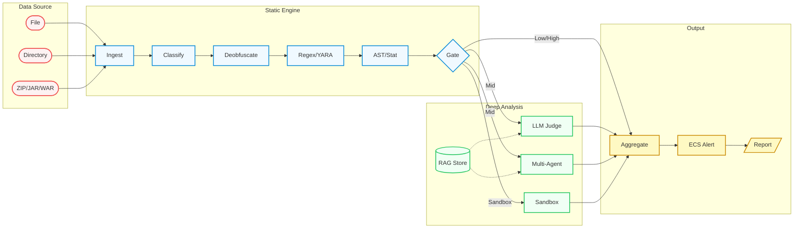
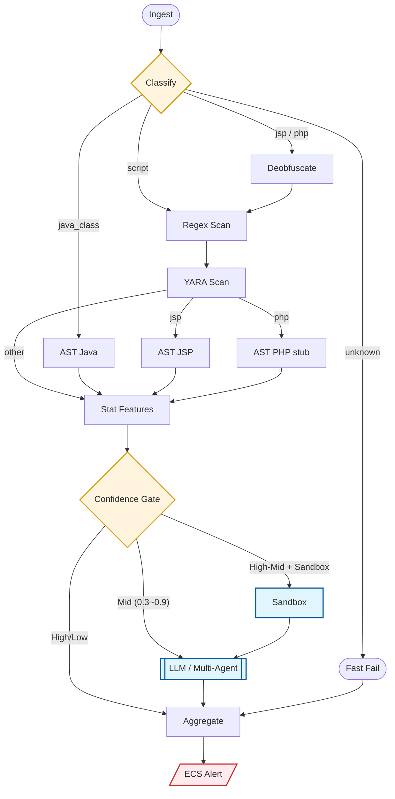
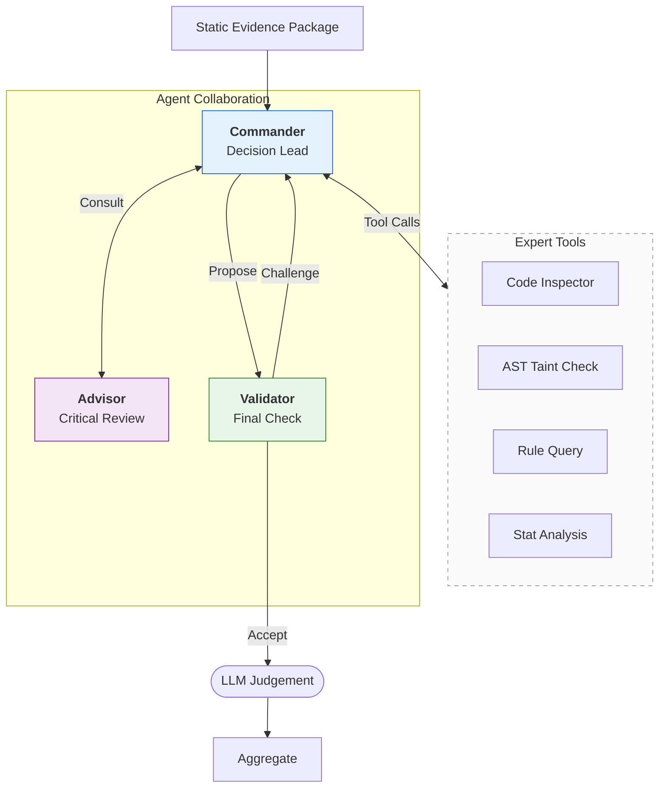
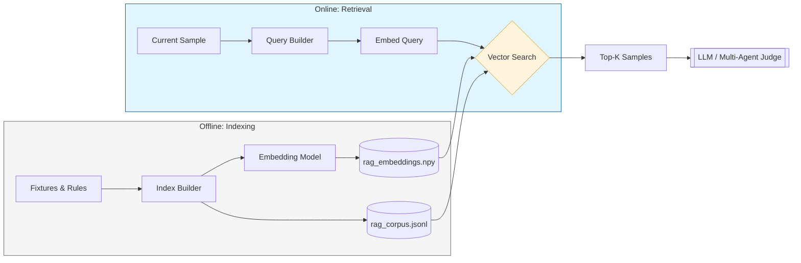

# Webshell Agent (WSA)

基于 LangGraph 的恶意脚本检测项目，当前实现重点覆盖 `JSP` 与 `Java .class` 场景，并提供可选的 `LLM`、`RAG`、多代理协作裁决能力。

项目入口命令是 `wsa`，核心包位于 `src/wsa`。

## 当前实现一览



- 基于 LangGraph 的扫描主图，包含 `ingest -> classify -> deobfuscate -> regex -> yara -> ast/stat -> gate -> llm/sandbox -> aggregate -> emit`
- 支持扫描单文件或目录，CLI 可识别扩展名：`.jsp`、`.jspx`、`.class`、`.jar`、`.war`、`.php`、`.phtml`、`.phar`、`.sh`、`.bat`、`.ps1`、`.py`
- 已内置规则与分析能力主要覆盖：
  - `14` 条 JSP Regex 规则
  - `12` 条 Java Regex 规则
  - `5` 条 JSP YARA 规则
  - `5` 条 Java YARA 规则
  - Java/JSP AST 分析：污点传播、反射链、ClassLoader 滥用、危险类型实例化
- 支持可选的 LLM 复判
  - 单模型模式：`llm_judge`
  - 多代理模式：`Commander + Advisor + Validator`
- 支持可选的 RAG 检索增强裁决
- 聚合后会生成 ECS 风格告警结构，CLI 默认输出表格，也支持 `json` / `jsonl`

## 实际能力边界

这部分基于当前代码而不是设计文档。

- 内置检测重点是 `JSP` 和 `Java .class`
- `PHP` 文件会进入去混淆、规则/YARA、统计特征流程，但当前仓库没有专门的 PHP Regex/YARA 规则，`ast_php` 也是占位节点
- CLI 接受 `.jar` / `.war`，仓库里也有 [`src/wsa/tools/jar_scanner.py`](src/wsa/tools/jar_scanner.py)，但主 CLI 和主图目前没有把 JAR/WAR 解包深扫接入默认扫描流程
- Sandbox 仅对 `jsp` / `php` 提供 Docker 执行路径
- 配置模型里存在一些预留项，例如 `checkpoint_backend`、`langsmith_enabled`、部分扫描参数；它们目前没有全部贯通到主 CLI 行为

## 处理流程



### 置信度与裁决

- 基础置信度来自证据源加权：
  - `yara=1.0`
  - `ast=1.0`
  - `regex=0.9`
  - `stat=0.5`
  - `llm=0.8`
- 多源高分命中会额外加成
- 高熵、超长行等统计异常会额外加成
- 主图分流 logic：
  - `confidence >= gate_high` 或 `<= gate_low`：直接聚合
  - `0.3 <= confidence < gate_high`：走 LLM
  - `confidence >= 0.7` 且启用 sandbox：先 sandbox，再 LLM
- 最终裁决阈值：
  - `>= 0.8` -> `malicious`
  - `>= 0.4` -> `suspicious`
  - `<= 0.15` -> `benign`
  - 其他 -> `unknown`

## 安装

### 基础依赖

- Python `3.11+`
- `uv`
- 可选：JDK
  - 用于 `javap`
  - 如果你额外放入 `vendor/cfr.jar`，会优先使用 CFR 反编译
- 可选：Docker
  - 用于 sandbox 行为分析

### 安装命令

```bash
uv sync --dev
```

如果需要 RAG：

```bash
uv sync --dev --extra rag
```

### LLM Provider 说明

默认依赖里已经包含 `Anthropic` provider。

如果你要切换到 `OpenAI` 或本地 `Ollama`，当前项目代码已支持，但需要你自行补装对应依赖：

```bash
uv add langchain-openai
uv add langchain-ollama
```

## 快速开始

### 1. 配置环境

```bash
cp .env.example .env
```

最小可用配置示例：

```dotenv
WSA_LLM_PROVIDER=anthropic
WSA_LLM_MODEL=claude-sonnet-4-20250514
ANTHROPIC_API_KEY=your_key
```

如果只想跑纯静态检测，可在命令行使用 `--no-llm`，不要求 API Key。

### 2. 扫描文件

```bash
# 扫描单个 JSP
uv run wsa scan "tests/fixtures/malicious/cmd_exec.jsp"

# 扫描目录
uv run wsa scan "tests/fixtures" --verbose

# 输出 JSON
uv run wsa scan "tests/fixtures" --format json --output "results.json"

# 跳过 LLM
uv run wsa scan "tests/fixtures" --no-llm

# 并发扫描
uv run wsa scan "tests/fixtures" --workers 8

# 按 glob 过滤
uv run wsa scan "tests/fixtures" --include "*.jsp"
```

### 3. 退出码

| 退出码 | 含义 |
| --- | --- |
| `0` | 全部为 benign / 无可扫描文件 |
| `1` | 至少一个 malicious |
| `2` | 无 malicious，但至少一个 suspicious |
| `3` | 扫描过程出现错误 |

## CLI

### `wsa scan`

```text
uv run wsa scan TARGET [OPTIONS]
```

| 参数 | 说明 | 默认值 |
| --- | --- | --- |
| `TARGET` | 文件、目录或 `.zip` | 必填 |
| `--format`, `-f` | `table` / `json` / `jsonl` | `table` |
| `--output`, `-o` | 输出文件路径 | stdout |
| `--workers`, `-w` | 并发数 | `4` |
| `--include` | glob 包含规则 | 无 |
| `--exclude` | glob 排除规则 | 无 |
| `--no-llm` | 禁用 LLM 裁决 | `false` |
| `--verbose`, `-v` | 表格模式下显示 Top Evidence | `false` |

说明：

- 当前 CLI 会自动解压 `.zip`
- `.jar` / `.war` 当前不会自动进入 `jar_scanner` 深扫流程

### `wsa rag`

```bash
# 基于 tests/fixtures 与 rules/regex 构建索引
uv run wsa rag build

# 增量添加文件
uv run wsa rag add "sample.jsp" --label malicious --tags behinder,rce

# 查看索引统计
uv run wsa rag stats

# 调试检索
uv run wsa rag search "Runtime.getRuntime().exec(request.getParameter())"
```

子命令：

- `build`
- `add`
- `stats`
- `search`

## 多代理模式

默认配置下：

```dotenv
WSA_AGENT_MODE=multi
```



主图在进入深度语义裁决时，会优先尝试多代理流程：

- `Commander`
  - 负责主裁决与工具调用
- `Advisor`
  - 负责二次意见与反驳视角
- `Validator`
  - 负责校验结论和置信度是否一致

多代理可调用的工具包括：

- `inspect_code_region`
- `run_ast_taint_check`
- `search_similar_samples`
- `check_java_imports`
- `decompile_class`
- `get_stat_anomalies`
- `query_detection_rules`
- `get_evidence_summary`

如果多代理流程异常，主图会回退到单模型 `llm_judge`。

## RAG 检索增强

启用方式：

```dotenv
WSA_RAG_ENABLED=true
WSA_RAG_INDEX_DIR=data
WSA_RAG_EMBEDDING_PROVIDER=local
WSA_RAG_EMBEDDING_MODEL=all-MiniLM-L6-v2
```



实现方式：

- 语料来源：
  - `tests/fixtures`
  - `rules/regex/*.yaml`
- 向量存储：
  - `rag_corpus.jsonl`
  - `rag_embeddings.npy`
- 检索结果会区分：
  - 相似恶意样本
  - 相似良性样本

## 关键配置项

所有配置都通过 `WSA_` 前缀环境变量读取，并支持 `.env`。

### 常用且已实际生效

| 变量 | 作用 | 默认值 |
| --- | --- | --- |
| `WSA_LLM_PROVIDER` | `anthropic` / `openai` / `local` | `anthropic` |
| `WSA_LLM_MODEL` | 主 LLM 模型名 | `claude-sonnet-4-20250514` |
| `WSA_LLM_TEMPERATURE` | 主 LLM 温度 | `0.0` |
| `WSA_LLM_MAX_TOKENS` | 主 LLM 最大输出 | `4096` |
| `WSA_LLM_TIMEOUT_SEC` | 主 LLM 超时 | `60` |
| `WSA_LLM_RETRY_COUNT` | 主 LLM 重试次数 | `2` |
| `WSA_LLM_BASE_URL` | 自定义网关 / 代理地址 | 空 |
| `WSA_LLM_API_KEY` | 自定义 API Key | 空 |
| `WSA_GATE_HIGH` | 高阈值 | `0.9` |
| `WSA_GATE_LOW` | 低阈值 | `0.1` |
| `WSA_SANDBOX_ENABLED` | 是否启用 sandbox | `false` |
| `WSA_RAG_ENABLED` | 是否启用 RAG | `false` |
| `WSA_RAG_INDEX_DIR` | RAG 索引目录 | `data` |
| `WSA_RAG_EMBEDDING_PROVIDER` | `local` / `openai` | `local` |
| `WSA_RAG_EMBEDDING_MODEL` | 嵌入模型 | `all-MiniLM-L6-v2` |
| `WSA_AGENT_MODE` | `single` / `multi` | `multi` |
| `WSA_AGENT_MAX_LOOPS` | 多代理最大循环次数 | `3` |
| `WSA_AGENT_MAX_LLM_CALLS` | 多代理 LLM 总预算 | `8` |
| `WSA_AGENT_MAX_TOOL_ROUNDS` | Commander 工具轮数 | `5` |
| `WSA_AGENT_ENABLE_ADVISOR` | 是否启用 Advisor | `true` |
| `WSA_AGENT_ENABLE_VALIDATOR` | 是否启用 Validator | `true` |

### 已定义但尚未完全贯通到主入口

这些配置存在于 [`src/wsa/config.py`](src/wsa/config.py)，但当前主 CLI 没有全部消费：

- `WSA_MAX_FILE_SIZE_MB`
- `WSA_SCAN_TIMEOUT_SEC`
- `WSA_SCAN_WORKERS`
- `WSA_CHECKPOINT_BACKEND`
- `WSA_PG_DSN`
- `WSA_LANGSMITH_ENABLED`
- `WSA_LLM_BUDGET_PER_FILE`

## 输出结果

聚合阶段会构造 ECS 风格结果，内部字段见 [`src/wsa/nodes/aggregate.py`](src/wsa/nodes/aggregate.py)。

JSON 输出示例：

```json
{
  "file_path": "tests/fixtures/malicious/cmd_exec.jsp",
  "tech_stack": "jsp",
  "verdict": "malicious",
  "confidence": 0.95,
  "evidence_count": 3,
  "evidences": [],
  "errors": []
}
```

内部还会生成更完整的 `_alert` 结构，包含：

- `event.kind`
- `event.severity`
- `file.hash`
- `threat.technique`
- `wsa.llm.*`

## 测试状态

当前仓库测试覆盖了规则、节点、图编排、RAG、LLM 裁决、多代理、JAR 扫描等模块。

运行命令：

```bash
uv run pytest -q
```

我在当前仓库本地执行的结果是：

```text
145 passed in 13.87s
```

E2E 夹具位于：

- `tests/fixtures/malicious`
- `tests/fixtures/benign`
- `tests/fixtures/hard_negatives`

其中端到端测试会校验：

- 恶意样本召回率 `>= 85%`
- 良性/困难负样本误报率 `<= 1%`

## 项目结构

```text
webshells-detector/
├─ rules/
│  ├─ regex/
│  ├─ yara/
│  └─ java_lib_whitelist.yaml
├─ src/wsa/
│  ├─ agents/        # 多代理编排、提示词、工具集
│  ├─ cli/           # Typer CLI
│  ├─ nodes/         # LangGraph 节点
│  ├─ rag/           # 语料、嵌入、向量检索
│  ├─ rules/         # Regex/YARA 加载器
│  ├─ tools/         # 反编译、JSP 预处理、AST、JAR 扫描
│  ├─ config.py
│  ├─ graph.py
│  ├─ llm_provider.py
│  └─ state.py
├─ tests/
│  ├─ e2e/
│  ├─ fixtures/
│  └─ unit/
├─ .env.example
├─ pyproject.toml
└─ uv.lock
```

## 扩展方式

### 添加 Regex 规则

放到 `rules/regex/*.yaml`：

```yaml
rules:
  - id: my_rule
    stack: jsp
    description: "自定义规则"
    pattern: 'Runtime\s*\.\s*getRuntime'
    severity: high
    confidence: 0.8
    tags: [webshell, rce]
```

### 添加 YARA 规则

放到 `rules/yara/<stack>/*.yar`：

```yara
rule my_rule {
    meta:
        confidence = "0.80"
        severity = "high"
        tags = "webshell,rce"
    strings:
        $a = "Runtime.getRuntime().exec" ascii
    condition:
        $a
}
```

## 已知限制

- 当前检测效果最可靠的目标是 `JSP` 和 `Java .class`
- `PHP` / 脚本文件类型已接入入口，但规则与 AST 能力仍不完整
- JAR/WAR 深扫工具已存在，但未默认串入 `wsa scan`
- Sandbox 是轻量行为探测，不是完整动态沙箱

## License

MIT
